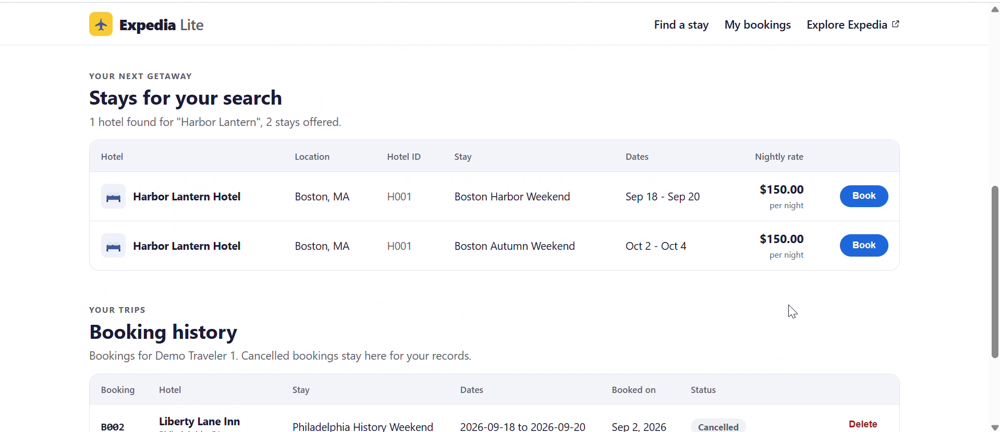
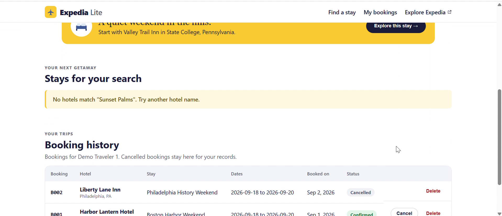
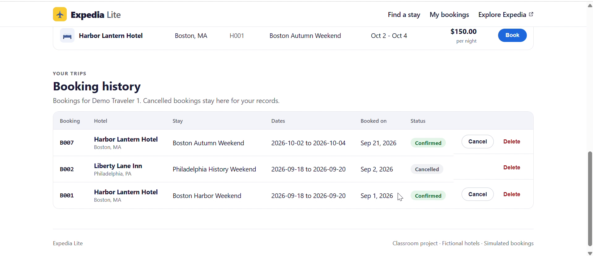
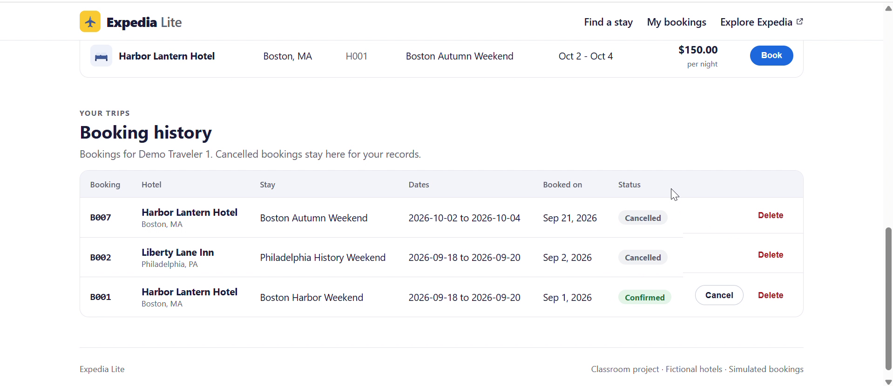
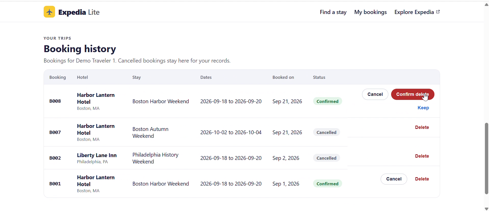
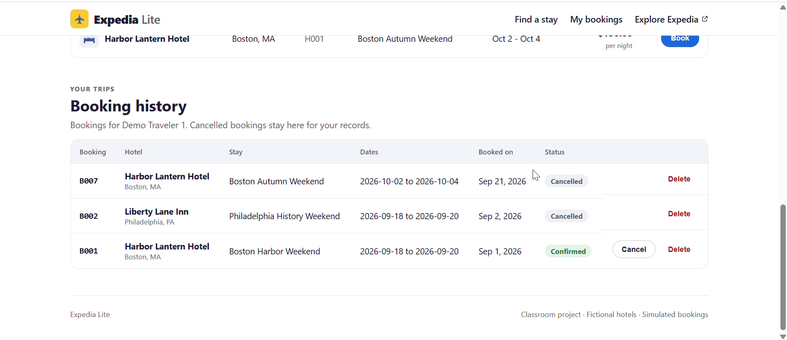
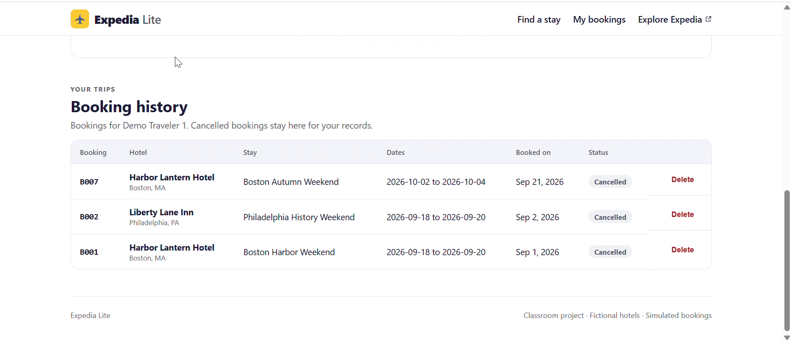

# Expedia Lite - Part 2

This report is also on GitHub, where the screenshots display and every link
resolves: https://github.com/Kelvin-prog-stu/expedia-lite/blob/main/report.md

## Repository and commit

Repository: https://github.com/Kelvin-prog-stu/expedia-lite

Commit submitted for Part 2: `ae0d7c31e07ffec7d00125563f2aeacdfca543ba` on `main`

- Part 2 was built on the feature branch `feature/sqlite-crud` in three commits:
  `a9cbb08` (SQLite storage and the MVC booking controller), `d57f1a3` (the
  redesigned interface with booking, history, cancel, and delete), and `7096d03`
  (documentation).
- The branch was merged into `main` as `b87b9fa`. The combined app was checked
  on `main` and pushed.
- The submitted commit adds this report, its screenshots, the demo video, and the
  final documentation updates on top of that merge. It changes no application
  code.
- The Part 1 checkpoint, `6f4b9f03727a96ceff711d7d92a4c0a5381d1df0`, is still in
  `main`'s history: `git merge-base --is-ancestor 6f4b9f0 main` succeeds.

## Implementation

Expedia Lite now does three things: search hotels by name, book a stay for a
demo traveler, and keep a booking history where each booking can be cancelled
or deleted. Everything is stored in SQLite and survives restarts.

### Changes since Part 1

- **SQLite replaces the CSV reads.** On the first start, `backend/seed.py` loads
  `hotels.csv`, `trips.csv`, `users.csv`, and `bookings.csv` into
  `backend/expedia_lite.db`, keeping their IDs, and writes a `seeded` marker.
  Every later start sees the marker and leaves the data alone. After seeding,
  every read and write goes to SQLite. The CSVs are read nowhere else, and Part
  1's `data_source.py` is gone.
- **Model-View-Controller.** `backend/models.py` is the Model,
  `backend/database_controller.py` is the database controller, and the Vue
  components are the View. FastAPI routes sit between them.
- **All four CRUD actions run from the frontend.** Book creates a booking, the
  history reads it back, Cancel updates its status to `cancelled` and keeps the
  row, and Delete removes it after a second click to confirm.
- **New IDs never collide with supplied ones.** The first new booking is `B007`,
  one past the highest supplied ID. The next number is stored in the database,
  not worked out from the rows present, so a deleted ID is never handed out
  again.
- **A redesigned interface**, chosen with the In-class Activity 2 method and
  written up in [docs/ui-research.md](https://github.com/Kelvin-prog-stu/expedia-lite/blob/main/docs/ui-research.md).
  It uses Expedia's layout (hero, overlapping search card, illustrated category
  icons, one promotional banner) and Priceline's two-month calendar, and
  avoids Booking.com's crowded home page.

### Responsibilities

- **Vue frontend, the View** (`frontend/src/`). `App.vue` lays out the page and
  holds the interaction state. `SearchResults.vue`, `BookingHistory.vue`, and
  `DateRangePicker.vue` are the parts a person works with. Every request goes
  through `src/api.js`, the only place that calls `fetch`.
- **FastAPI** (`backend/main.py`). Each route receives a request from the View,
  validates it with the Pydantic models in `backend/schemas.py`, makes one call
  to the database controller, and returns the result. A missing record becomes
  a 404 with a readable message, handled once at the application level.
- **Python backend.** `models.py` defines the four tables, their foreign keys (a
  trip belongs to a hotel; a booking connects a traveler to a trip), a `CHECK`
  on booking status, and entity classes for each record's fields.
  `database_controller.py` is the only module that runs SQL: it checks that the
  referenced traveler and stay exist before writing, and performs every create,
  read, update, and delete. Its input and output contracts are in the design
  note.

### One operation, end to end: creating a booking

```
[Book on a stay]       SearchResults.vue -> App.vue            View
        |  createBooking('U001', 'T009')                 frontend/src/api.js
        v
POST /api/bookings                                       backend/main.py
        |  db.create_booking('U001', 'T009')
        v
check U001 and T009 exist, take the next ID, INSERT      database_controller.py
        |
        v
new row in the bookings table                            models.py
        |
        v
201 {"booking_id": "B007", "status": "confirmed", ...}
        |
        v
BookingHistory.vue lists B007 as Confirmed
```

Observed: at about 0:30 in the demo video, booking Boston Autumn Weekend (`T009`)
as Demo Traveler 1 produced `B007`, confirmed, at the top of the history. Given a
trip ID that does not exist, the same route returned 404 `No stay with ID T999.`
and the booking count did not change.

### Dependencies

No dependency was added. Following CHECK, then TAKE ACTION, then VERIFY for
SQLite: CHECK found that the project interpreter in `backend/.venv` (Python
3.12.5) imports `sqlite3`, backed by SQLite 3.45.3. TAKE ACTION: nothing was
missing, so installation was skipped. VERIFY: the backend created and seeded
`backend/expedia_lite.db` on its first start, with 8 hotels, 12 trips, 6 users,
and 6 bookings. `backend/requirements.txt`, `frontend/package.json`, and
`frontend/package-lock.json` are unchanged since Part 1.

## Verification

Manual review: the Part 2 changes were scanned in VS Code. Each file in the
three feature-branch commits was opened from the Source Control graph, and each
file changed for the submitted commit was opened in Source Control before
committing.

The browser checks below come from the demo video, which was recorded against a
freshly seeded database. Times are approximate positions in the video.

| Action | Expected result | Observed result |
| --- | --- | --- |
| Search `Sunset Palms` (0:13) | A clear no-results message | `No hotels match "Sunset Palms". Try another hotel name.` |
| Search `Harbor Lantern` (0:25) | The hotel and its offered stays in a labelled table | `1 hotel found for "Harbor Lantern", 2 stays offered.` Boston Harbor Weekend and Boston Autumn Weekend, $150.00 per night, each with a Book button |
| Book Boston Autumn Weekend as Demo Traveler 1 (0:30). Create, then Read | A new booking in the history with the next ID | `B007`, Confirmed, booked Sep 21, 2026, listed above the supplied `B001` and `B002` |
| Cancel `B007` (0:38). Update | Status changes and the record stays | `B007` Cancelled, still listed, its Cancel button gone |
| Book Boston Harbor Weekend, then Delete and Confirm delete (0:40 to 0:49). Delete | The test booking is removed | `B008` appeared, the red Confirm delete showed, then `B008` was gone |
| Cancel the supplied booking `B001` (0:50) | A starter record can be updated too | `B001` Cancelled |
| Refresh the browser (0:52) | Every change remains | `B007` and `B001` Cancelled, `B008` absent |
| `GET /api/health` before the restart (1:05) | 6 supplied bookings plus `B007` | hotels 8, trips 12, users 6, bookings 7 |
| Stop and restart the backend and frontend (1:20 to 1:55) | Both come back without reseeding | Uvicorn and Vite shut down, then started again |
| Reload the app after the restart (2:07) | Changes remain, nothing duplicated, starter data not reloaded | `B007`, `B002`, `B001` Cancelled, `B008` absent, no duplicate rows. `B001` is still Cancelled, so the supplied CSV was not loaded again |
| `GET /api/health` after the restart (2:13) | The same counts | hotels 8, trips 12, users 6, bookings 7 |

Right after the restart, from about 1:59 to 2:06, the history briefly showed
`No bookings yet for Demo Traveler 1.` before the saved bookings appeared. The
history has no loading state, so it shows the empty message until the bookings
arrive. The data was intact, as the reload a moment later and the unchanged
counts show. This is listed under the limitations below.

Checks against the running backend with `curl`, after the recording:

| Action | Expected result | Observed result |
| --- | --- | --- |
| `POST /api/bookings` with trip `T999` | Rejected, nothing saved | 404 `No stay with ID T999.`, bookings still 7 |
| `POST /api/bookings` with traveler `U999` | Rejected, nothing saved | 404 `No traveler with ID U999.`, bookings still 7 |
| `PATCH /api/bookings/B008` after its deletion | Not found | 404 `No booking with ID B008.` |
| Stored next booking number after `B008` was deleted | Not reused | 9, so the next booking will be `B009` |
| `npm run build` | A clean production build | Exit 0, built in 3.73 s |

Checks during implementation, recorded in the handoff: searching `Inn` returns
the three inns, an empty search shows `Enter a hotel name.`, and the page has no
horizontal scroll at a 451 px viewport.

### Screenshots

Search for a hotel name from the supplied data:



Search with no matching hotel:



Create and Read: `B007` added to the history:



Update: `B007` cancelled and still listed:



Delete: the second click that confirms deleting the test booking `B008`:



After the delete, `B008` is gone:



After restarting both servers, every change is still there:



## Project context and next steps

- [README.md](https://github.com/Kelvin-prog-stu/expedia-lite/blob/main/README.md) - setup, run, and reset instructions, and the endpoints
- [AGENTS.md](https://github.com/Kelvin-prog-stu/expedia-lite/blob/main/AGENTS.md) - project rules: MVC boundaries, data rules, verification, SmokeTest, and AutoLoop
- [docs/design-note.md](https://github.com/Kelvin-prog-stu/expedia-lite/blob/main/docs/design-note.md) - frontend, FastAPI, and backend responsibilities, controller contracts, and the request flow
- [docs/ui-research.md](https://github.com/Kelvin-prog-stu/expedia-lite/blob/main/docs/ui-research.md) - the UI research behind the redesign
- [prompts/02-part2-ui-research.md](https://github.com/Kelvin-prog-stu/expedia-lite/blob/main/prompts/02-part2-ui-research.md) and [prompts/03-part2-sqlite-crud.md](https://github.com/Kelvin-prog-stu/expedia-lite/blob/main/prompts/03-part2-sqlite-crud.md) - the prompts that shaped Part 2
- [handoffs/current.md](https://github.com/Kelvin-prog-stu/expedia-lite/blob/main/handoffs/current.md) - what works, what was checked, limitations, and the next task

Remaining limitations:

- There is no authentication. The Booking as selector is the only notion of who
  is booking, so anyone can book, cancel, or delete for any demo traveler. The
  optional bonus (demo login and surge pricing) was not attempted.
- Dates are a planning aid. Every stay has fixed dates, so the calendar does not
  filter results.
- A traveler can book the same stay more than once.
- The booking history has no loading state, so it can show its empty message
  for a moment before the bookings arrive, as in the video after the restart.
- There are no automated tests. Verification was manual, as the assignment asks.
- Only Stays works. The other categories link out to Expedia.

Next task: give the booking history a loading state so a slow first request
never looks like an empty history. The optional authentication and pricing
bonus from In-class Activity 3 remains open.

## Demo video

[docs/demo/part2-demo.mp4](https://github.com/Kelvin-prog-stu/expedia-lite/blob/main/docs/demo/part2-demo.mp4)
is 2 minutes 17 seconds long, with no audio. On GitHub, open it and choose View
raw to play it or Download to save it.

It shows a search with no results and one that matches, then every CRUD action
through the frontend on bookings added after seeding: create `B007`, read it in
the history, cancel it, and create and delete `B008`. It then shows a supplied
booking cancelled, a browser refresh, and a restart of both servers, after which
every change remains and the record counts are unchanged. The table under
Verification gives the time of each step.
