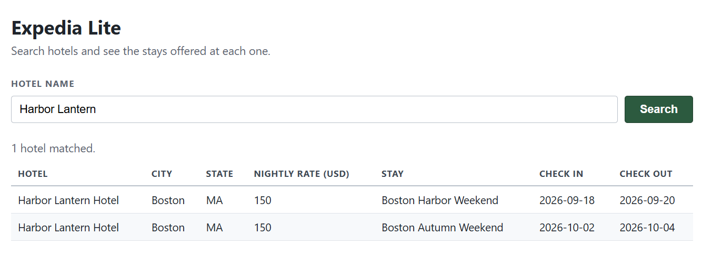
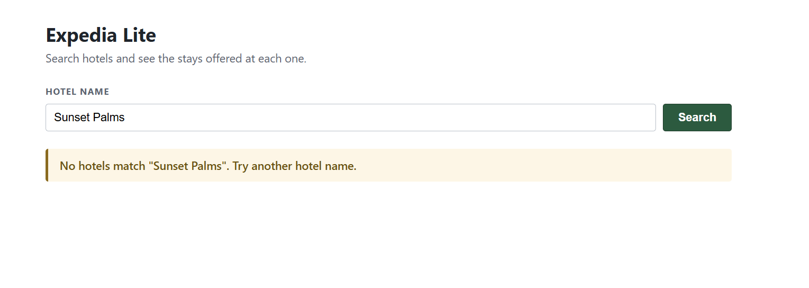

# Expedia Lite - Part 1

## Repository and commit

Repository: https://github.com/Kelvin-prog-stu/expedia-lite

Commit submitted for Part 1: `c1cbd56b3fd90a7fdddb553eabe1a4855aa5d84f`

## Implementation

Expedia Lite searches the supplied hotel data by name and shows the stays
offered at each matching hotel. The three layers have separate jobs.

The **Vue frontend** (`frontend/src/App.vue`) owns what the person sees: a
labelled hotel-name input, a Search button, the results table, and the
no-results message. It holds the query and the last response in component
state and does no filtering of its own, so whatever the backend returns is
what the table shows. Every network call goes through `frontend/src/api.js`,
which is the only place in the app that calls `fetch`.

**FastAPI** (`backend/main.py`) is the boundary between the two halves. It
exposes `GET /api/hotels`, reads the `name` query parameter, calls the data
layer, and validates the response through the Pydantic models in
`backend/schemas.py` before it goes out. It contains no file access and no
search logic. A missing CSV is turned into a structured error by one
application-level handler rather than a `try`/`except` inside the route.

The **Python backend data layer** (`backend/data_source.py`) owns the CSV
files. It reads `hotels.csv` and `trips.csv`, filters hotels by name
case-insensitively, and attaches each hotel's offered stays by matching
`trips.hotel_id` to `hotels.hotel_id`. It imports nothing from FastAPI, so
the search can be exercised without a running server. Keeping the join here
rather than in the interface is what lets Part 2 replace the CSV reads with
SQLite without the frontend changing.

In development Vite proxies `/api` to port 8000, so the frontend holds no
backend hostname anywhere and requests stay same-origin.

## Verification

Manual review: every changed file was scanned in VS Code before committing,
and `git status` and `git diff` were checked against the intended change.
Both servers were run and the checks below were performed in the browser at
http://localhost:5173/.

| Action | Expected result | Observed result |
| --- | --- | --- |
| Search `Harbor Lantern` | The matching hotel with its offered stays in a labelled table | `1 hotel matched.` and two rows: Harbor Lantern Hotel, Boston, MA, 150, Boston Harbor Weekend, 2026-09-18 to 2026-09-20; and the same hotel with Boston Autumn Weekend, 2026-10-02 to 2026-10-04 |
| Search `Sunset Palms` | A clear message that nothing matched, and no table | `No hotels match "Sunset Palms". Try another hotel name.` The table element was not rendered |
| `GET /api/hotels?name=harbor` | One hotel carrying two trips | `count: 1`, Harbor Lantern Hotel, Boston MA, 150, trips Boston Harbor Weekend and Boston Autumn Weekend |
| `GET /api/hotels?name=zzz` | An empty result, not an error | `{"query":"zzz","count":0,"hotels":[]}` |
| `GET /api/health` | HTTP 200 with the app version | `{"status":"ok","version":"1.0.0"}` |
| Start the app with no CSV files present | A readable message, not a stack trace | HTTP 500 with `{"error":{"code":"data_file_missing","message":"hotels.csv was not found in ... Extract the supplied data pack into that folder."}}` |
| `npm run build` | A clean production build | Exit 0, 13 modules transformed |

The two stays returned for one hotel confirm the `hotel_id` join: `T001` and
`T009` both reference `H001`.

Dependency checkpoint, following CHECK then TAKE ACTION then VERIFY. CHECK
found Python 3.12.5, Node v24.14.1 and npm 11.11.0 already installed, all
meeting the tools' stated requirements. TAKE ACTION installed
`fastapi[standard]==0.141.1` into `backend/.venv` and `vue`, `vite` and
`@vitejs/plugin-vue` into `frontend/node_modules`, both project-local with no
system change. VERIFY confirmed the interpreter resolves inside
`backend/.venv` and reported `fastapi 0.141.1`, `uvicorn 0.52.4`,
`pydantic 2.13.5`, `starlette 1.6.0`, `vue 3.5.42`, `vite 7.3.6` and
`@vitejs/plugin-vue 6.0.8`.

### Screenshots

Successful search for a hotel name from the supplied data:

Search with no matching hotel:

## Project context and next steps

- [README.md](README.md) - setup and run instructions, endpoints, and where the
  data files go
- [AGENTS.md](AGENTS.md) - project rules, including the dependency checkpoint
  and the verification expectations
- [docs/design-note.md](docs/design-note.md) - frontend, FastAPI, and backend
  responsibilities, with the request flow
- [prompts/01-part1-csv-search.md](prompts/01-part1-csv-search.md) - the prompt
  that produced Part 1
- [handoffs/current.md](handoffs/current.md) - what works, what was checked,
  limitations, and the next task

Remaining limitations. Search matches hotel names only, so a city or a stay
name returns nothing. Nothing is stored: every request re-reads the CSV files,
and there is no booking or history yet. `nightly_rate_usd` is carried as the
string read from the CSV and displayed as-is. There are no automated tests;
the assignment asks for manual browser verification and that is what was done.

Next task is Part 2, due Tuesday 2026-09-15: seed a SQLite database from all
four CSV files, then move every read and write to it, adding booking creation,
booking history, cancellation that keeps the record, and deletion, all driven
from the frontend through FastAPI. That work happens on a feature branch and
merges into `main`, preserving this Part 1 checkpoint commit.
